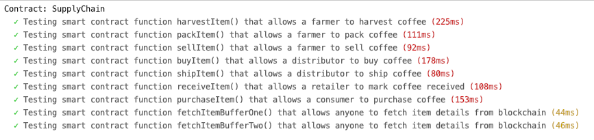
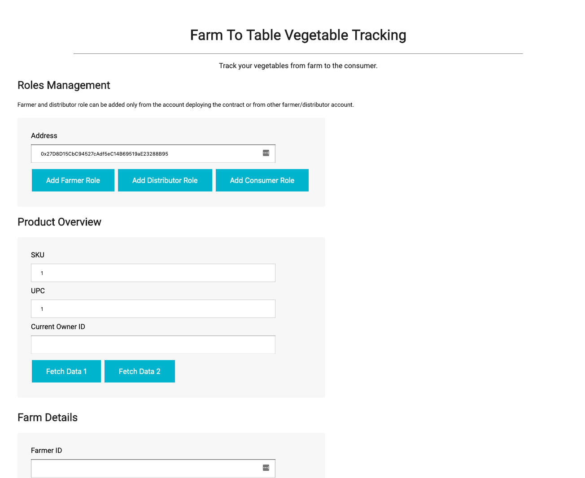
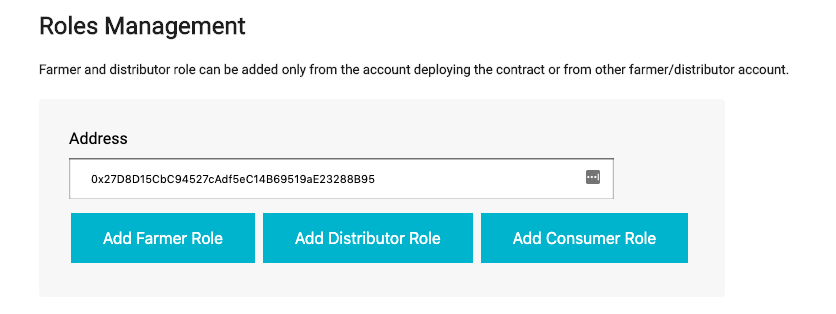
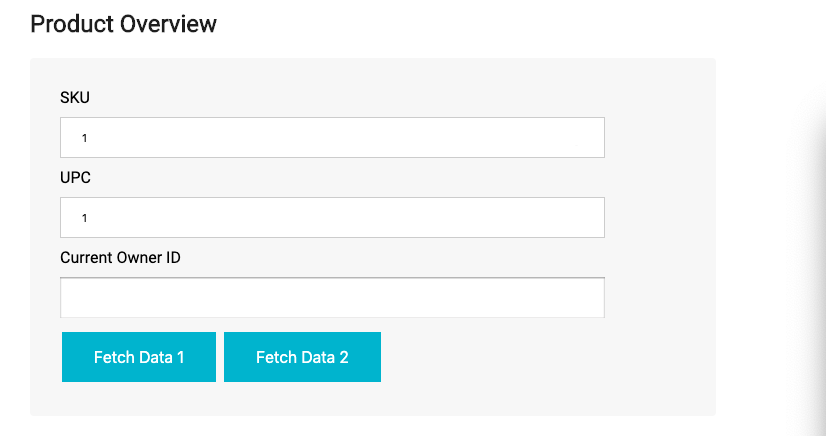
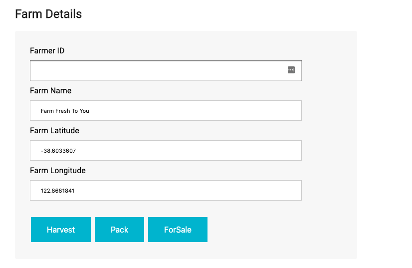
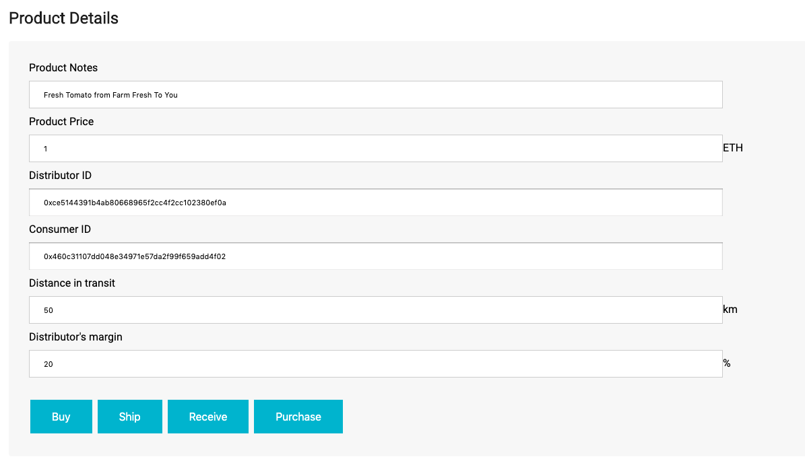

# Vegetables - farm to table supply chain & data auditing

This repository containts an Ethereum DApp that a Supply Chain blockchain solution for "Farm To Table" vegetable tracking desinged in part A of Project 6.
Compared to example Fair Trade Coffee application, it does not include Retailer role. It also tracks additional data, such as "distance in transit" to assure
vegetables freshness.

## Design

### Activity Diagram


### Sequence Diagram


### State Diagram


### Class Diagram


## Getting Started

These instructions will get you a copy of the project up and running on your local machine for development and testing purposes. See deployment for notes on how to deploy the project on a live system.

### Prerequisites

Please make sure you've already installed ganache-cli, Truffle and enabled MetaMask extension in your browser.

#### Core libraries versions

* `node`: v10.14.1
* `truffle`: v5.0.24
* `web3`: v1.0.0-beta.37
* `solc`: v0.4.24 (configured with `truffle-config.js`)

#### Added libraries

* `truffle-assertions` to refactor unit test code
*  `truffle-hdwallet-provider` to facilitate deployment to Rinkeby network with Infura

### Installing

A step by step series of examples that tell you have to get a development env running

Clone this repository:

```
git clone https://github.com/rpaluch/Project_6
```

Change directory to ```project-6``` folder and install all requisite npm packages (as listed in ```package.json```):

```
cd project-6
npm install
```

Launch Ganache:

```
ganache-cli -m "spirit supply whale amount human item harsh scare congress discover talent hamster"
```

In a separate terminal window, Compile smart contracts:

```
truffle compile
```

This will create the smart contract artifacts in folder ```build\contracts```.

Migrate smart contracts to the locally running blockchain, ganache-cli:

```
truffle migrate
```

Test smart contracts:

```
truffle test
```

All 9 tests should pass.



In a separate terminal window, launch the DApp:

```
npm run dev
```

## Web Application Guide

When running the application, your UI should look like this



### Roles management

In order to get through a supply chain you'll neet to set up roles for your Test network accounts. By default account
deploying the contract gets all the roles. It also has privileges to add roles to other accounts. So from this account
use the Roles Management UI section to assing roles to other test accounts. Simply, copy-paste account number dedicated
to specific role and click matching button: Add Farmer Role, Add Distributor Role, Add Consumer Role.



### Product Overview

In this section you can set parameters such as SKU and UPC, before harvesting vegetables. Use Fetch Data 1, Fetch Data 2
buttons to update data in corresponding sections from the network.



### Farm Details
In this section you can view and edit farm details. Please update the Farmer ID field with the address of account that has
been assigned the Farmer role. From this section you can perform actions such as Harvest, Pack, For Sale that indicate
progress of the vegetable boxes in the supply chain.



### Product Details
In this section you can view and edit product details. You can also use the buttons from this sections to indicate further
progress of vegetable boxes in the supply chain. Please note that actions in this section require changing to the account with
specific role:
* Buy - Distributor role
* Ship - Farmer role
* Receive - Distributor role
* Purchase - Consumer role

As you go, use Fetch Data 1 and Fetch Data 2 buttons to receive data updates from the network. For example, you'll see
that owner ID changes in Product Overview section, as well as Distributor ID and Consumer ID are set on the way.

 

## Built With

* [Ethereum](https://www.ethereum.org/) - Ethereum is a decentralized platform that runs smart contracts
* [IPFS](https://ipfs.io/) - IPFS is the Distributed Web | A peer-to-peer hypermedia protocol
to make the web faster, safer, and more open.
* [Truffle Framework](http://truffleframework.com/) - Truffle is the most popular development framework for Ethereum with a mission to make your life a whole lot easier.


## Authors

Rafał Paluch

## Acknowledgments

* Solidity
* Ganache-cli
* Truffle
* IPFS

## Contract deployed to Rinkeby test network
https://rinkeby.etherscan.io/address/0x38805cf6357ebdbf7f6f9a1592df74ba812eb9da#code